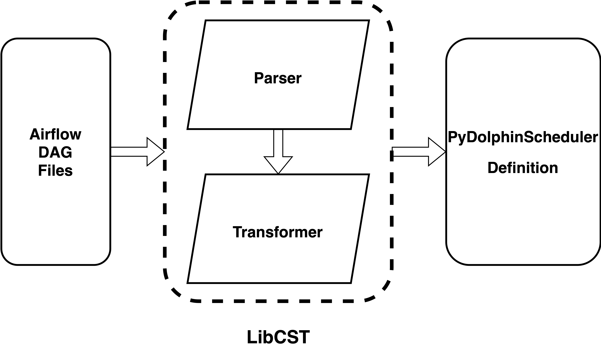

Architecture
============

Air2phin is a rule-based AST transformer, using `LibCST <https://github.com/Instagram/LibCST>`_ to parse and transform Python code,
and Yaml file to define the transformation rules.

The main data flow is as below:

And the steps of the transformation are:

- Get source content from files of stdin.
- Load all the rules from the YAML file.
- Parse the source content into a LibCST.
- Transform the CST tree based on the rules.
- Provide the result to original f ile path with :code:`-air2phin` as stem suffix(by default, also support :doc:`inplace migrate <howto/migrate-inplace>`) or stdout.